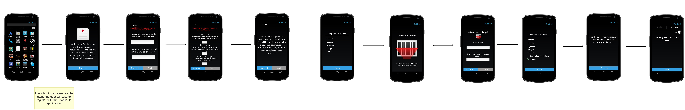
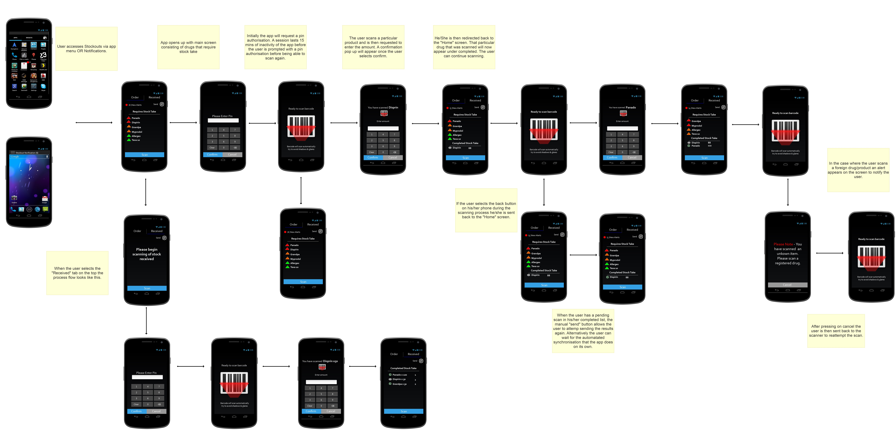

# Cell-Life Stock Out App

This Android app is designed to be used by Facilities to manage their drug stocks.

[Stock Out Overview PPT](docs/Stock%20Out%20Overview.pptx)

## Screen designs

### Registration of a new Facility

Once the app is installed on a device, and the device has registered with the celllife-stock server, 
some parameters must be entered in order to allow the app to calculate when to prompt for stock take. 

These parameters are:
 - lead time: the time it takes (on average) for stock to arrive once it has been ordered
 - safety time: the number of days of minimum stock the facility should have before re-ordering
 - operating days: the number of days per week the facility is open
 
The app then requests the user to perform a stock take of the drugs and provide an estimate of 
the amount used per day. This is just an estimate for app to calculate when the second stock take
should be requested.

### Workflow

Once the app has been installed the server will send alerts to the app to notify the user when stock 
takes are required. The notifications are displayed in the Android notification bar and by 
using a badge counter displayed on the app icon. It will do that for each drug so the user is only required
to do stock take on specific drugs where there is a danger of running but, but the users can perform 
stock take at any time.

## Scanning

Scanning is done using the Zxing app. Please use these barcodes to test:

 - [Testing barcodes](docs/barcodes.pdf)
 - [Testing labels](docs/Testing%20labels.pdf)
 
## Server

In order to test the app, a Stock Server will need to be installed and running on a public IP address. Please see: [Cell-Life Stock server](https://github.com/cell-life/celllife-stock)
 
## Technical documentation

[CLS-0003-StockOutApp](docs/CLS-0003-StockOutApp-260214-1323-14.pdf)

This app was designed and developed by Cell-Life in 2014. 
